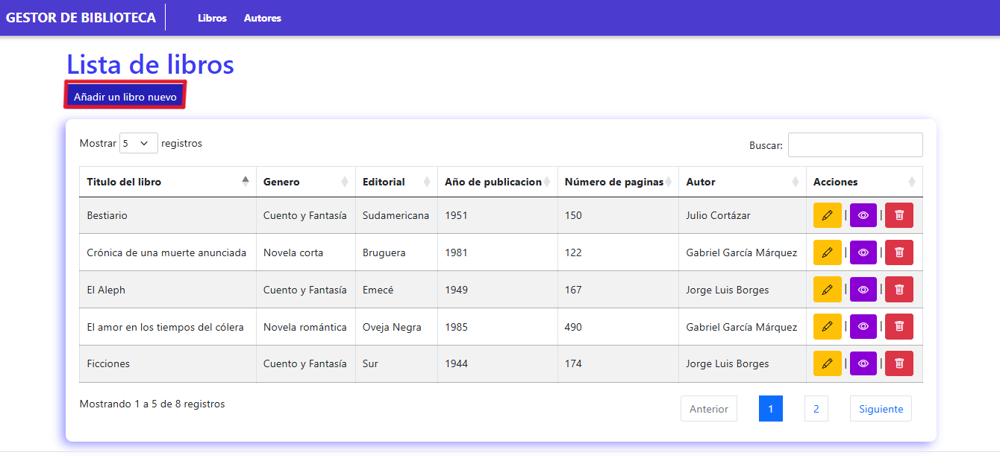
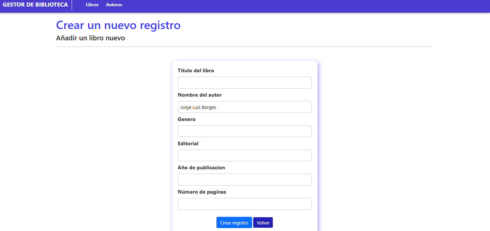
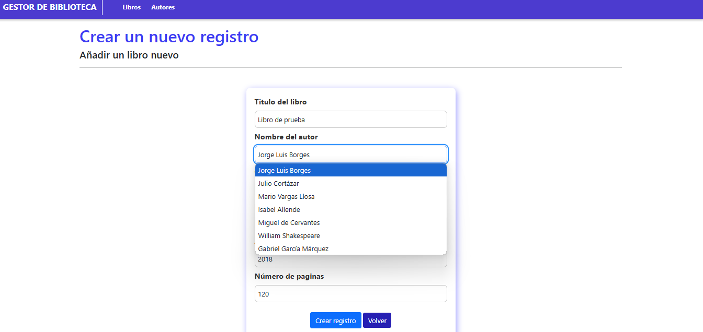
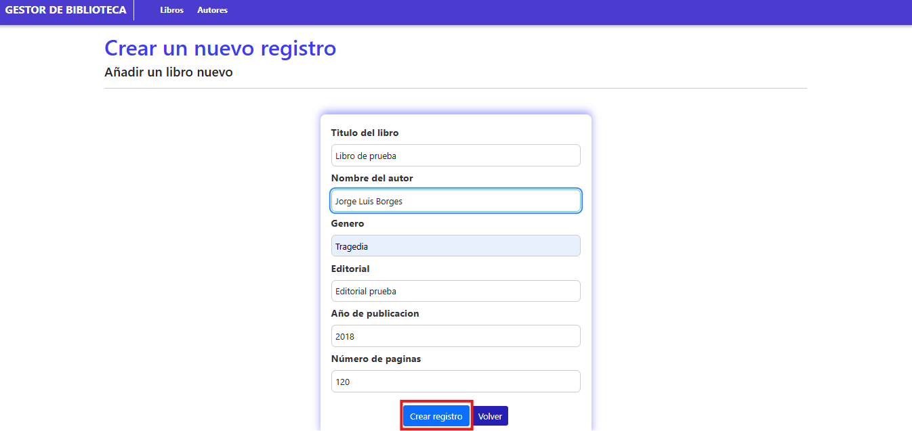
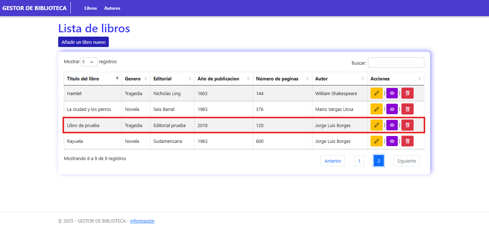
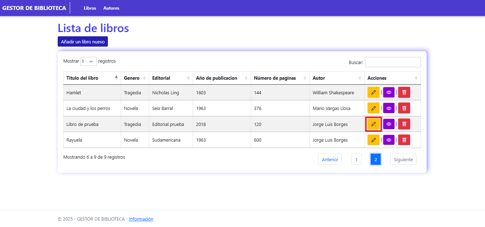
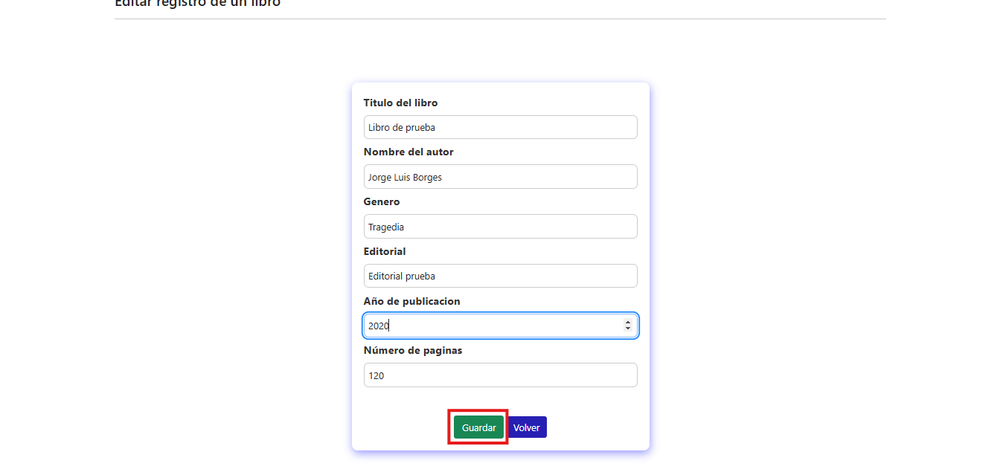
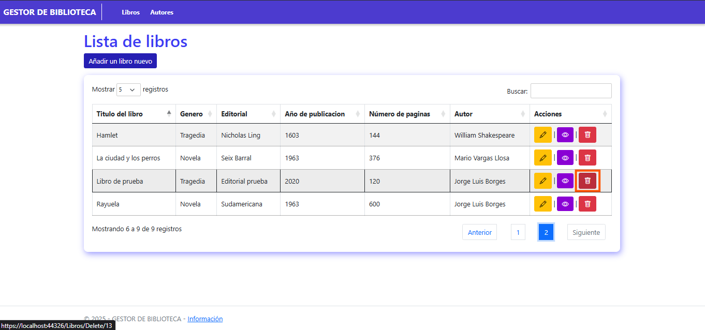
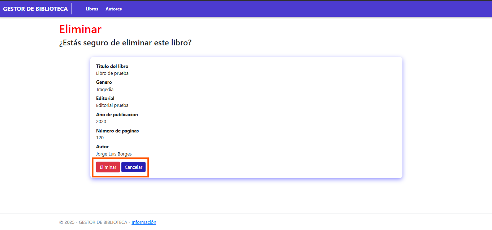
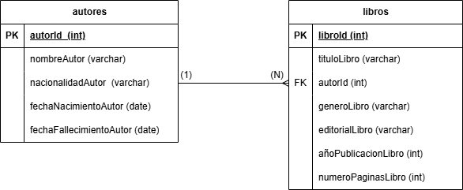

# Gestor de biblioteca.

## Descripcion del proyecto 📑:
- Este proyecto es una aplicación web desarrollada en ASP.NET con Entity Framework, maneja la gestión simple de bibliotecas que permite a los usuarios realizar operaciones CRUD (Crear, Leer, Actualizar y Eliminar) sobre libros y autores. Está diseñado para facilitar la administración de una colección de libros, permitiendo un acceso eficiente a la información de cada obra y su respectivo autor.

  ### Caracteristicas principales:
  - Gestion de libros y autores (CRUD completo).
  - Interfaz sencilla e intuitiva facil para la navegacion.
  - Búsqueda y filtrado de libros y autores.
  - Relación entre libros y autores, permitiendo asignar múltiples libros a un mismo autor.
  - Validación de datos para evitar registros duplicados o incorrectos.

  ### Tecnologías utilizadas:
  - ASP.NET Core para el desarrollo backend.
  - Entity Framework Core para la interaccion de la base de datos.
  - SQL SERVER como motor de base de datos.
  - Bootstrap para una interfaz responsiva y atractiva.
  - HTML, CSS y JavaScript para la estructura y dinámica de la aplicación.

## Pasos para configurar la aplicacion 🛠️: 
  ### Requisitos previos:
  #### Antes de comenzar, debe asegurarse de tener instalados los siguientes programas en su sistema: 
  - .NET SDK (9.0).
  - SQL Server (o SQL Server Express).
  - SQL Server Management Studio (SSMS) (opcional, pero recomendado).
  - Visual Studio (preferiblemente con soporte para ASP.NET y EntityFramework).
  - Git (para clonar el repositorio).

  ### 1. Clonar el repositorio:
  Para obtener la copia del proyecto en su equipo, deberá abrir una terminal o PowerShell (tambien es recomendado hacerlo con la terminal de git) y ejecutar el siguiente comando: `git clone https://github.com/JuanArenas-Dev/Biblioteca.git`.

   Luego acceda al directorio del proyecto con el siguiente comando: `cd Biblioteca `, tenga en cuenta que este comando puede variar dependiendo del lugar en el que usted ejecute la terminal de comandos para clonar el repositorio, tambien podría usar el comando `cd C:\Users\"su_usuario"\Biblioteca` por si su sistema lo guardo de manera predeterminada.
    

###  2. Configurar la base de datos

Para que la aplicación funcione correctamente, es necesario configurar la base de datos en **SQL Server** siguiendo estos pasos:

####  1. Abrir SQL Server Management Studio (SSMS)

1. Debera abirir **SQL Server Management Studio (SSMS)**.  
2. En la ventana de conexión, ingrese los datos de su servidor SQL:  
   - **Servidor**: `localhost` (si está usando SQL Server localmente) o el nombre de su servidor.  
   - **Autenticación**:  
     - **Autenticación de Windows** (si usa *Integrated Security*).  
     - **Autenticación de SQL Server** (si usa usuario y contraseña, ingreselos aquí).  
3. Haga clic en **Conectar**.  

####  2. Crear la base de datos usando el script SQL  

Una vez conectado al servidor, siga estos pasos para ejecutar el script que crea la base de datos:  

1. En **SSMS**, haga clic en **Nueva consulta** en la barra superior.  
2. Haga clic en **Archivo** → **Abrir** → **Archivo...** y seleccione el archivo `biblioteca.sql` ubicado en la carpeta del repositorio clonado.   
3. Con el script abierto, presione **F5** o haga clic en el botón **Ejecutar**.  
4. Una vez finalizada la ejecución, debería ver un mensaje indicando que las tablas y los registros se crearon correctamente.

## 3. Configurar la cadena de conexión  

1. Abra **Visual Studio** y cargue el proyecto.  
2. Dirijase al archivo **appsettings.json** y edite la cadena de conexión en la sección `"ConnectionStrings"`:  

```json
"ConnectionStrings": {
  "DefaultConnection": "Server=TU_SERVIDOR;Database=NombreDeTuBD;User Id=TU_USUARIO;Password=TU_CONTRASEÑA;Trusted_Connection=True;MultipleActiveResultSets=true"
}
Nota: Si usa autenticación de Windows en SQL Server, reemplace "User Id" y "Password" con "Integrated Security=True", así:
"ConnectionStrings": {
  "DefaultConnection": "Server=TU_SERVIDOR;Database=NombreDeTuBD;Integrated Security=True;MultipleActiveResultSets=true"
}
```
#### 4. Aplicar migraciones con Entity Framework  (Opcional, si la base de datos no esta creada, realizo cambios en el modelo)

Si la base de datos no está creada o desea asegurarse de que todas las migraciones están aplicadas correctamente, abra una terminal en la carpeta del proyecto y ejecute:  

```sh
dotnet ef database update
```
#### 5. Ejecutar la aplicación  

Para ejecutar la aplicación, siga estos pasos:  

1. En **Visual Studio**, seleccione el proyecto y presione **F5** para iniciarlo.  
2. Alternativamente, puede ejecutarlo desde la terminal con el siguiente comando:
3. 
```sh
dotnet run
La aplicación se iniciará y estará disponible en el navegador en:
http://localhost:5000
(El puerto puede variar según la configuración de tu proyecto.)
```
## Principales funcionalidades 📌:
#### Nota: Todas las funcionalidades mencionadas, funcionan de la misma manera en el apartado libros como en el apartado autores.
### Crear: 
  Tanto en la sección de **Libros** como en la de **Autores**, se pueden crear registros. Para ello, deberá hacer clic en el botón ubicado en la parte superior izquierda de la tabla, el cual es de color azul oscuro y está denominado como **"Añadir un libro nuevo"** o **"Añadir un nuevo autor"**, dependiendo de la sección en la que se encuentre.  

  

  El sistema lo redireccionará al formulario donde podrá ingresar los datos para crear el nuevo registro. Para el apartado de **Libros**, en el cuadro de texto denominado **"Nombre del autor"**, deberá seleccionar el autor correspondiente.  
 

  (**Nota**: En caso de que no encuentre el autor para el registro del libro que está ingresando, deberá crear un nuevo registro en el apartado de **Autores**).  

Luego de haber completado correctamente todos los campos, deberá hacer clic en el botón central inferior de color azul claro denominado **"Crear registro"**. Si desea volver a la lista, deberá hacer clic en el botón de color morado denominado **"Volver"**.  


  
  
  

  El sistema lo redireccionará a la lista de registros o tabla, donde podrá visualizar el registro que acaba de crear.  

  
   

### Editar: 

Para editar un registro, en la columna de acciones de la lista de registros o tabla, deberá hacer clic en el botón de color amarillo con el símbolo de un lápiz.  

 

 El sistema lo redireccionará al formulario donde podrá editar la información del registro. Una vez haya realizado los cambios deseados, deberá hacer clic en el botón central inferior de color verde denominado **"Guardar"**.  


 

El sistema lo redireccionará a la lista de registros o tabla, donde podrá visualizar el registro editado.  
 

### Detalles: 

Para ver los detalles de un registro, en la columna de acciones de la lista de registros o tabla, deberá hacer clic en el botón de color morado con el símbolo de un ojo.  


 El sistema lo redireccionara a la visual donde podrá ver la información detallada del registro, si quiere editar la información, deberá dar clic en el bóton inferior de color amarillo con simbolo de lapíz, en caso de querer volver a la lista de registros o tabla, deberá hacer clic en el bóton de color morado denominado como **Volver**.

 

### Eliminar: 

Para eliminar un registro, en la columna de acciones de la lista de registros o tabla, deberá hacer clic en el botón de color rojo con el símbolo de una papelera.  


 

El sistema lo redireccionará a una ventana de confirmación donde podrá ver detalladamente la información del registro que va a eliminar. Si está seguro de eliminar el registro, deberá hacer clic en el botón inferior de color rojo denominado **"Eliminar"**. En caso de que no desee eliminar el registro, deberá hacer clic en el botón de color morado denominado **"Cancelar"**.  

**¡Importante!**: Si desea eliminar un registro en el apartado de **Autores**, tenga en cuenta que, al eliminarlo, también se eliminarán todos los libros asignados a dicho autor.  




### Filtros de búsqueda y ordenamiento:

En la lista de registros o tablas de cualquiera de los dos apartados, encontrará filtros de búsqueda.  

- Para buscar un registro por medio de una palabra clave, deberá escribirla en el campo denominado **"Buscar"**, el cual está resaltado con un recuadro de color verde claro en la imagen.  

- Para buscar un registro por páginas, deberá hacer clic en los botones ubicados en la esquina inferior derecha, los cuales corresponden a los números de página de la lista de registros o tabla a la que desea acceder. Estos están resaltados con un recuadro de color morado en la imagen.  

- Si desea ver más datos en la lista de registros o tabla, deberá hacer clic en el selector denominado **"Mostrar"**. De esta manera, podrá seleccionar la cantidad de registros que desea ver por página. Este selector está resaltado con un recuadro de color naranja en la imagen.  

- Para ordenar la información de forma descendente o ascendente, encontrará un icono con símbolo de flecha junto a los encabezados de la lista de registros o tabla. Deberá hacer clic en estos iconos para cambiar el orden de los datos.  


## Enlace del repositorio: 

Enlace del repositorio: https://github.com/JuanArenas-Dev/Biblioteca.git

## Diagrama entidad relacion de la base de datos:

### 1. Introducción
Este diagrama representa la estructura de la base de datos de una biblioteca, mostrando las entidades principales, sus atributos y relaciones.

### 2. Explicación de Entidades y Atributos

### **Autor**  
Representa a los escritores de los libros. Tiene los siguientes atributos:  
- `autorId` (Clave primaria, `INT`, `NOT NULL`)  
- `nombreAutor` (`VARCHAR`, `NOT NULL`)  
- `nacionalidadAutor` (`VARCHAR`)
- `fechaNacimientoAutor` (`DATE`)
- `fechaFallecimientoAutor` (`DATE`)  

### **Libro**  
Representa los libros registrados en la biblioteca.  
- `libroId` (Clave primaria, `INT`, `NOT NULL`)  
- `tituloLibro` (`VARCHAR`, `NOT NULL`) 
- `autorId` (Clave foránea, `INT`, `NOT NULL`)
- `generoLibro` (`VARCHAR`)
- `editorialLibro` (`VARCHAR`)
- `añoPublicacionLibro` (`int`)
-  `numeroPaginasLibro` (`int`)
  
### 3. Explicación de Relaciones y Cardinalidad

### **Relación (1:N entre Autores y Libros)**  
- Un **Autores** pueden escribir **muchos** libros.  
- Un **Libros** tiene **un solo** autor.
    




  

  


  
   
     

    
